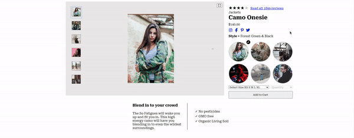
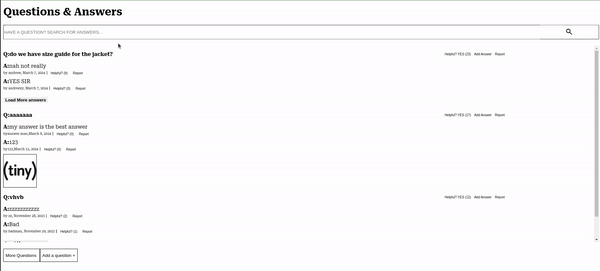

# Atelier front end Product Detail component

## Description

This component is a responsive, front-end application tailored for e-commerce platforms. It facilitates easy examination of product information through a user-friendly interface. Developed with contemporary UI/UX principles, Shopify ensures smooth interaction with product details.

This project is a collaborative effort by four engineers in collaboration to implement a comprehensive "Product Detail" component within a larger e-commerce platform.

## Features

Shopify is structured around four primary components, each responsible for a distinct aspect of the e-commerce experience.

<br />

CLICK ON THESE COMPONENTS to see them in action!

<details>
  <summary style="font-size: 16px; font-weight: bold; color: lightblue"><u>Product Details: by Eric Yap</u></summary>

  <br />

  

</details>

<details>
  <summary style="font-size: 16px; font-weight: bold; color: lightblue"><u>Related Items: by Michael O'Brien</u></summary>

  <br />

  

</details>

<details>
  <summary style="font-size: 16px; font-weight: bold; color: lightblue"><u>Questions & Answers: by Nhu Le</u></summary>

  <br />

  

</details>

<details>
  <summary style="font-size: 16px; font-weight: bold; color: lightblue"><u>Ratings & Reviews: by Vincent Lieu</u></summary>

  <br />

  

</details>

## Technologies Used

Shopify leverages a suite of modern development tools and frameworks, including:

- React.js: For building dynamic UI components.
- Webpack: For efficient bundling of assets and modules.
- Babel: For transpiling ES6+ JavaScript code to backwards-compatible versions.
- ESLint: To ensure code consistency and prevent errors.
- Jest & React Testing Library: For comprehensive testing of React components.

## Installation and Setup

```bash

# Clone the repository
git clone https://github.com/DOMino-s-Pizza/shopify-fe.git

# Navigate to the project directory
cd shopify

# Install dependencies
npm install --production

# Configure environment variables
nano .env
# Add the following variables:
# PORT - Assign to your preferred port for running Shopify
# GIT_API_KEY - Your GitHub API key with permissions for read:org, user, read:user, user:email, user:follow

# Launch the application
npm run server-dev

# For development and custom modifications:
# Install the development dependencies
npm install
# Change mode to 'development' in webpack.config.js
npm run client-dev

# To test components:
npx jest
```

<br />
<br />

###### ReadMe authored by Michael O'Brien